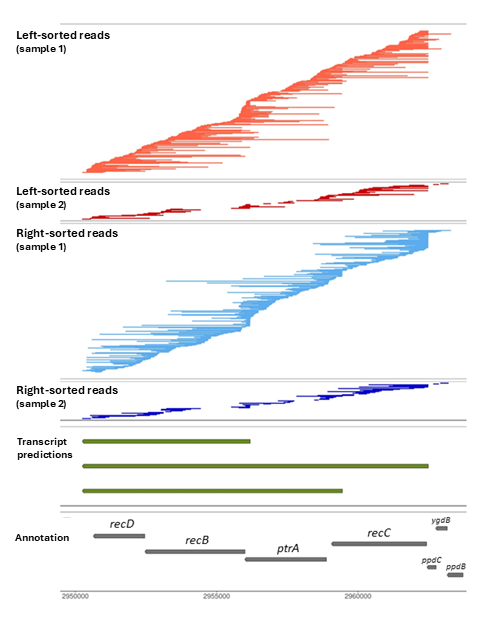

# plot-ONT-alignments
R scripts to visualize right-sorted and left-sorted ONT alignments in a region of interest

These R scripts can be run directly at the command line with bed files from ONT alignments. They were used in the manuscript below, please cite if using them:

Mattick JSA, Bromley RE, Watson KJ, Adkins RS, Holt CI, Lebov JF, Sparklin BC, Tyson TS, Rasko DA, Dunning Hotopp JC. (2024). Deciphering transcript architectural complexity in bacteria and archaea. mBio15:e02359-24.   
[Manuscript link](https://doi.org/10.1128/mbio.02359-24)

Example plots:

